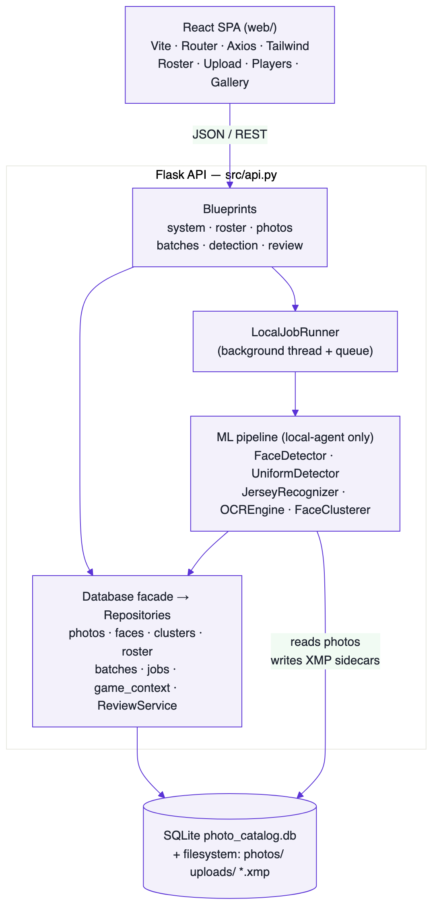
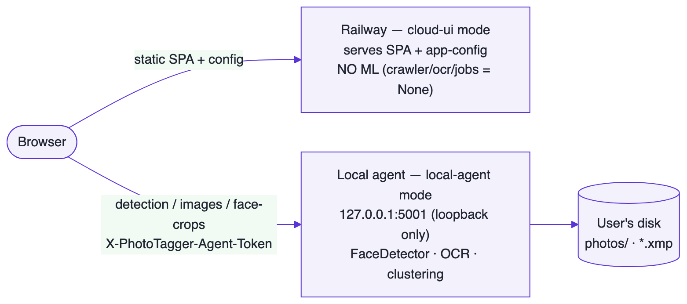
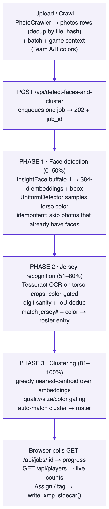
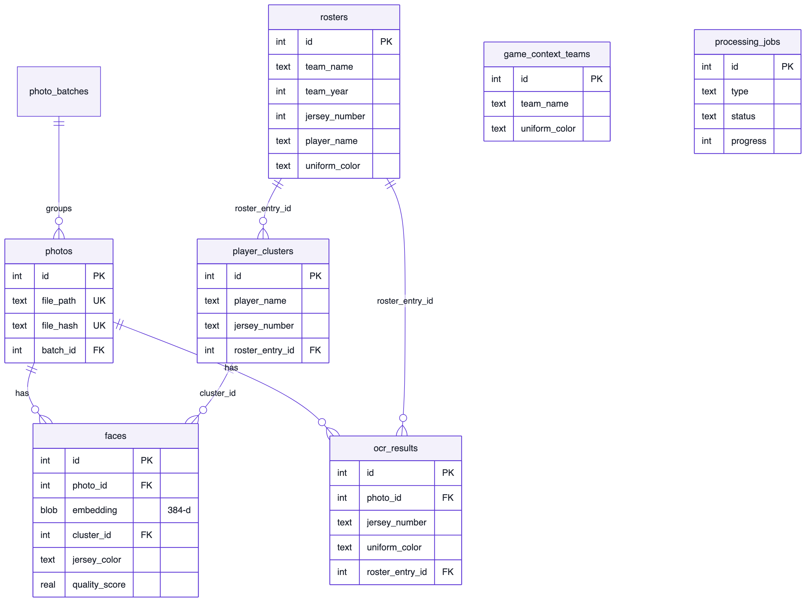

# PhotoTagger — Architecture

**Status:** Living document · **Last updated:** 2026-06-04 · **Audience:** engineers
working on or integrating with PhotoTagger.

This document explains how PhotoTagger is built: the major components, how a photo
flows from disk to a tagged gallery, the data model, and the key design decisions
(and their trade-offs). For *how to use* the app, see the
[User Guide](USER_GUIDE.md). For setup commands, see the [README](../README.md).

---

## 1. Context & goals

PhotoTagger is a **local-first photo discovery system for Ultimate Frisbee
tournaments**. Given a folder of game photos and team rosters, it answers one
question: *"Show me every photo of this player."*

It does this by combining three signals per photo:

1. **Faces** — detected and embedded, then clustered into player identities.
2. **Jersey numbers** — read via OCR from the torso region below each face.
3. **Roster data** — jersey number + uniform color → a named player on a team.

### Design goals

| Goal | Why | How it shows up |
|------|-----|-----------------|
| **Local-first / private** | Photos are personal; ML shouldn't require uploading them to a cloud | A "local agent" process runs all ML against the user's filesystem; originals never leave the machine |
| **Non-destructive** | Photographers won't tolerate mutated originals | Tags are written to **XMP sidecars** (`photo.xmp`), never the image file |
| **Zero-config ML** | Target users aren't engineers | Models lazy-load; CPU-only; sensible thresholds in `config.py` |
| **Resumable & observable** | Detection over hundreds of photos takes minutes | Async **job runner** with progress; idempotent stages skip already-processed photos |
| **Deployable as a hosted UI** | Share a link without a local install | A `cloud-ui` runtime mode serves the React dashboard separately from the ML agent |

### Non-goals

- Real-time / streaming detection (this is a batch tool).
- Multi-user accounts or RBAC (single-user, single SQLite DB).
- GPU optimization (CPU `onnxruntime` is the supported path).

---

## 2. High-level design

PhotoTagger is a **full-stack monolith with a pluggable runtime mode**: one Flask
backend (Python) + one React SPA (TypeScript), talking over a JSON/REST API. The
same backend code runs in two modes, selected by `PHOTOTAGGER_MODE`.



### Component responsibilities

| Layer | Module(s) | Responsibility |
|-------|-----------|----------------|
| **SPA** | `web/src/` | UI, polling job progress, drawing face/jersey bounding boxes |
| **API app factory** | `src/api.py` | `create_app()`: wires DB, registers blueprints, CORS, auth, OCR self-test |
| **HTTP routes** | `src/blueprints/*` | Thin request/response handlers; enqueue jobs; no ML logic inline |
| **Job runner** | `src/job_runner.py` | Single background thread + queue; runs long ML tasks, tracks status/progress |
| **ML pipeline** | `face_detector`, `ocr`, `jersey_recognition`, `uniform_detector`, `face_cluster` | The actual computer vision |
| **Data facade** | `src/db.py` | `Database` owns one connection + lock; composes repositories |
| **Repositories** | `src/repositories/*` | All SQL; one class per table/domain |
| **Read model** | `src/review_service.py` | Cross-domain queries (tagged vs. needs-review) |
| **Persistence** | `src/schema.py` | Idempotent `CREATE TABLE` + additive `ALTER TABLE` migrations |
| **Sidecars** | `src/metadata_sidecar.py` | Non-destructive XMP write of player/team tags |

---

## 3. Deployment topology — the two runtime modes

The single most important architectural decision is the **split between a hosted
UI and a local ML agent**, controlled by `PHOTOTAGGER_MODE`.

### Mode A — `local-agent` (default)

Everything in one process on the user's machine. Has filesystem access, so it
instantiates the crawler, OCR engine, and job runner and does all ML. The
browser hits `http://127.0.0.1:5001`, and that single Flask process serves the
API (and optionally the SPA), runs `FaceDetector` / OCR / clustering, reads
`photos/`, and writes `*.xmp` sidecars.

Bind address is `127.0.0.1` (loopback only) — the agent is not exposed to the
network. This is the privacy boundary.

### Mode B — `cloud-ui` (hosted; the Railway deployment)

Built into a Docker image (`Dockerfile` sets `PHOTOTAGGER_MODE=cloud-ui`) and
deployed to Railway. It **serves the compiled React SPA** but deliberately does
**not** instantiate the ML components:

```python
# src/api.py — create_app()
if get_runtime_mode() == "cloud-ui":
    app.crawler = None
    app.ocr_engine = None
    app.job_runner = None       # heavy ML is NOT available here
```

The hosted dashboard points the browser's API client at a **local agent URL**
(default `http://127.0.0.1:5001`, overridable and persisted in `localStorage`).
The browser talks to the hosted origin for static assets and to the user's own
local agent for ML — keeping photos on the user's machine even when the UI is
served from the cloud.



### Why split this way?

| Force | Resolution |
|-------|-----------|
| Users want a shareable link, no install | Host the UI (`cloud-ui`) |
| Photos must stay on the user's disk | Keep ML + filesystem on the `local-agent` |
| The cloud box can't (and shouldn't) hold gigabytes of photos | `cloud-ui` has no crawler/OCR; it's a thin shell |
| A loopback agent could be driven by any website | CORS **allowlist** (not `*`) + optional bearer/`X-PhotoTagger-Agent-Token` |

**Trade-off:** the split adds a configuration surface (the browser must know the
agent URL and token) and means some endpoints simply don't work in `cloud-ui`.
The benefit — privacy + shareability — is worth it for this product.

---

## 4. Data flow — from folder to tagged gallery

The end-to-end pipeline is orchestrated by the `detect-faces-and-cluster` job
(`src/blueprints/detection.py`), which runs three phases inside one background
task with progress reported at each step.



Key properties:

- **Idempotent stages.** Phase 1 skips photos that already have faces, so re-runs
  after adding new photos are cheap.
- **Progress is durable.** The job's `result` JSON is updated in SQLite at each
  step, so the browser can reconnect and resume polling.
- **OCR is color-gated.** Game context (Team A = black, Team B = white) tells the
  recognizer which roster to match a number against — this is what disambiguates
  two players who both wear #19 on opposing teams.

---

## 5. The ML pipeline in detail

### 5.1 Face detection & embedding — `face_detector.py`

- **InsightFace** `buffalo_l`, CPU (`CPUExecutionProvider`), `det_size=640×640`.
- Produces a **384-dim** embedding + bounding box + detection confidence per face.
- Also computes face **quality** signals (sharpness via Laplacian variance, size
  ratio) used later to filter background/crowd faces.

### 5.2 Uniform / jersey-color sampling — `uniform_detector.py`

- HSV histogram matching against synthetic reference histograms for common
  colors (red, white, black, blue, …).
- `sample_face_jersey()` samples the **torso patch below the face bbox** to label
  each face with a jersey color + confidence. This feeds both subject filtering
  and roster matching.

### 5.3 Jersey number OCR — `jersey_recognition.py` + `ocr.py`

Two OCR engines exist for different jobs:

- **`JerseyRecognizer`** (Tesseract via `pytesseract`) — the primary path used by
  the detection job. Reads digits from tight torso crops, color-gated by game
  context, with digit sanity rules from `config.py`
  (`JERSEY_DIGIT_MIN/MAX_LENGTH`, `JERSEY_BBOX_MAX_ASPECT_RATIO`,
  `JERSEY_BBOX_OVERLAP_DEDUP_IOU`).
- **`OCREngine`** (EasyOCR) — heavier, used by the standalone CLI/`/api/process-ocr`
  path; lazy-loads a ~1 GB model, upscales 4× + CLAHE + unsharp for faint numbers.

> ⚠️ **Tesseract temp-dir gotcha.** `pytesseract` round-trips images through
> `$TMPDIR`; on some sandboxed macOS environments Leptonica can't read
> `/tmp/…` / `/var/folders/…`, so every OCR call failed *silently* (returned
> `[]`). `ensure_ocr_ready()` points the temp dir at a project-local `.ocr_tmp`,
> runs a synthetic-digit **self-test** at startup, and surfaces the result as
> `ocr_ok` in `GET /health`. This is why a dead OCR backend is now visible
> instead of producing zero detections forever.

### 5.4 Clustering & auto-match — `face_cluster.py`

- **Greedy nearest-centroid** clustering on cosine similarity (default threshold
  `0.40`). For each face, join the most-similar existing cluster above threshold,
  else start a new one.
- Pre-cluster **gating** (`config.py`): `MIN_FACE_QUALITY_SCORE`,
  `MIN_FACE_SIZE_RATIO`, jersey-color + relative-size rules
  (`SUBJECT_REL_FRAC`, `NONTEAM_MIN_SIZE`) drop spectators and blur while keeping
  genuine players in wide shots.
- After clustering, clusters are **auto-matched to roster players** using the
  jersey detections from Phase 2.

**Trade-off:** greedy single-pass clustering is O(faces × clusters) and order-
sensitive — simpler and fast enough for tournament-scale sets (hundreds–low
thousands of faces), but it can split one person into two clusters. The UI
mitigates this with **manual consolidation** (`/api/consolidate-player/...`) and
per-photo deselect.

---

## 6. Data model

SQLite, one file (`photo_catalog.db`). Schema is created idempotently in
`src/schema.py`, which also performs **additive migrations** via
`ALTER TABLE … (try/except)` and one guarded table rebuild (rosters
`jersey_number` TEXT→INTEGER).



| Table | Holds | Notes |
|-------|-------|-------|
| `photos` | Ingested files | Dedup by `file_hash` **and** `file_path` (both UNIQUE) |
| `faces` | Detections + embeddings | Embedding stored as BLOB; `cluster_id` links to identity |
| `ocr_results` | Jersey numbers | One row per detection, with bbox + `roster_entry_id` |
| `player_clusters` | Face identities | Counts kept both as columns *and* recomputed live in queries |
| `rosters` | Players | `UNIQUE(team_name, team_year, jersey_number)` |
| `game_context_teams` | This game's two teams + colors | Drives color-gated OCR matching |
| `photo_batches` | Import folders | Groups photos for per-folder team/year metadata |
| `processing_jobs` | Async job state | `payload`/`result`/`error` are JSON text |

**Cluster counts are computed live.** `get_all_player_clusters` /
`get_cluster_by_id` recompute `face_count` / `photo_count` from the `faces` table
via subqueries (the stored columns are a cache). This keeps counts correct after
faces are reassigned or deselected — but it means tests that create clusters
without real face rows see zero counts (a known footgun).

---

## 7. Concurrency & threading model

- **One SQLite connection**, `check_same_thread=False`, guarded by a single
  `threading.RLock` shared by every repository (`src/db.py`). All writes serialize
  on that lock.
- **Flask dev server runs `threaded=True`.** Rationale (documented in `api.py`):
  the dashboard polls many lightweight endpoints (health, summaries, job status)
  *while* a long multi-file upload is in flight. Single-threaded Werkzeug
  serializes requests, starving the polls → `ERR_EMPTY_RESPONSE` surfaced as
  "Network Error". Threading + the DB lock resolves this safely.
- **`LocalJobRunner`** is a single daemon thread draining a `queue.Queue`. Jobs
  run **one at a time**, FIFO. Each job gets its `job_id` and updates progress in
  the DB as it goes. Failures are caught and recorded as `status="failed"`.

**Trade-off:** one global lock + one worker thread = no write contention and
simple reasoning, at the cost of no parallel job execution. For a single-user
batch tool this is the right simplicity/throughput balance; the OCR engine itself
parallelizes internally via a `ThreadPoolExecutor` where it helps.

---

## 8. API surface

REST/JSON. Long operations return **`202 Accepted` + `job_id`**; clients poll
`GET /api/jobs/:id`. Grouped by blueprint:

| Blueprint | Representative endpoints | Purpose |
|-----------|--------------------------|---------|
| `system` | `GET /health`, `GET /api/app-config`, `GET /api/jobs/:id`, `POST /api/data/reset`, `GET /<spa assets>` | Health (incl. `ocr_ok`), config, job status, SPA serving |
| `roster` | `GET/POST/PUT/DELETE /api/roster`, `/api/roster/import[-url]`, `/api/roster/infer[-url]`, `GET/PUT /api/game-context` | Roster CRUD, file/URL import, game context |
| `photos` | `POST /api/upload-photos`, `POST /api/crawl`, `POST /api/process-ocr`, `GET /api/search`, `GET /api/image/:id` | Ingest, search, image serving |
| `detection` | `POST /api/detect-faces-and-cluster`, `/api/detect-faces`, `/api/cluster-players`, `GET /api/players`, `GET /api/photos/:id/jersey-detections`, `GET /api/face-crop/:id`, `POST /api/consolidate-player/:name` | The ML pipeline + results |
| `review` | `GET /api/processing-summary`, `/api/confirmed-photos`, `/api/review-photos`, `POST /api/players/:id/assign`, `/match-similar`, `/api/faces/deassign` | Tag review & assignment |
| `batches` | `GET/PUT/DELETE /api/batches[/:id]` | Import-folder metadata |

**Auth & CORS.** When `PHOTOTAGGER_AGENT_TOKEN` is set, every `/api/*` request
(except `/health` and `/api/app-config`) must present it via
`X-PhotoTagger-Agent-Token` or `Authorization: Bearer …`. CORS is an
**allowlist** of origins (`PHOTOTAGGER_ALLOWED_ORIGINS`, defaulting to the local
Vite/preview ports) — never `*`, so a random site can't drive the loopback agent.

---

## 9. Frontend architecture

- **Vite + React 19 + React Router**, single `PhotoTaggerClient` (Axios) in
  `web/src/api/photoTaggerClient.ts` as the only network boundary.
- **Configurable base URL.** Resolved from `localStorage`
  (`phototagger.localAgentUrl`) → `VITE_LOCAL_AGENT_URL` → `VITE_API_BASE_URL` →
  empty (same-origin). This is what lets the hosted `cloud-ui` point at a user's
  local agent.
- **Pages** map 1:1 to the workflow tabs: Roster → Upload → Players → Gallery,
  plus Review, Batches, Search.
- **Bounding-box overlays.** `PhotoLightbox.tsx` + `utils/bboxUtils.ts` draw face
  and jersey boxes over the served image, picking contrasting colors against the
  sampled background.
- **Job polling.** Components submit a job, then poll `GET /api/jobs/:id` for
  progress + per-stage `result` until terminal.

---

## 10. Key decisions & trade-offs (summary)

| Decision | Alternative | Why this choice | Cost |
|----------|-------------|-----------------|------|
| Local agent does ML; UI can be hosted | Upload photos to cloud for ML | Privacy: originals never leave the machine | Extra config (agent URL/token); some endpoints dead in `cloud-ui` |
| SQLite, single file | Postgres / service DB | Zero-config, single-user, portable | No concurrent writers, no multi-user |
| One connection + global lock | Connection pool | Simple, correct, no contention bugs | Serialized writes |
| Single-thread job queue | Multiprocessing / Celery | Simple, observable, enough for batch sizes | No parallel jobs |
| XMP sidecars | Embed tags in image / DB-only | Non-destructive; portable to Lightroom etc. | Extra file per photo |
| Greedy nearest-centroid clustering | HDBSCAN / agglomerative | Fast, incremental, easy to reason about | Can over-split; needs manual consolidate |
| Tesseract (primary) + EasyOCR (CLI) | One engine | Tesseract is light for the hot path; EasyOCR for hard cases | Two code paths to maintain |
| Idempotent additive migrations in code | A migration framework | No dependency; safe re-runs | Schema history lives in `try/except` blocks |

---

## 11. Integration & extension points

- **New ML stage:** add a module under `src/`, instantiate it inside the relevant
  job in `src/blueprints/detection.py`, and report progress via
  `db.jobs.update_processing_job`. Keep heavy work off the request thread — always
  go through `LocalJobRunner`.
- **New persisted field:** add a guarded `ALTER TABLE` in `src/schema.py` and a
  method on the owning repository in `src/repositories/`. Never write SQL in a
  blueprint.
- **New endpoint:** add a route to the appropriate blueprint; return `202 +
  job_id` for anything slow.
- **Tuning detection:** all thresholds live in `src/config.py` (face quality,
  OCR confidence, clustering threshold, subject-size gating). Change them there,
  not inline.
- **Tags consumed downstream:** read the `*.xmp` sidecars
  (`metadata_sidecar.py` writes IPTC `PersonInImage` + organization fields).

---

## 12. Known limitations & where to look next

- **Clustering over-splits** a person across photos with very different poses →
  manual consolidate is the workaround. A second agglomerative pass keyed on
  jersey number would reduce this.
- **`cloud-ui` is a thin shell** — without a reachable local agent, detection,
  image serving, and face crops don't work. The UX depends on the agent URL being
  configured correctly.
- **Color-gated OCR depends on accurate game context.** Wrong Team A/B colors →
  numbers matched to the wrong roster. This is the most common "why is it
  mistagged" cause.
- **CPU-only ML.** Detection of hundreds of photos is minutes, not seconds. GPU
  execution providers are not wired up.

---

## See also

- [User Guide](USER_GUIDE.md) — end-user workflow with screenshots
- [README](../README.md) — setup & commands
- [CLAUDE.md](../CLAUDE.md) — repository conventions
- Source entry points: `src/api.py` (app factory),
  `src/blueprints/detection.py` (the pipeline), `src/db.py` (data facade)
