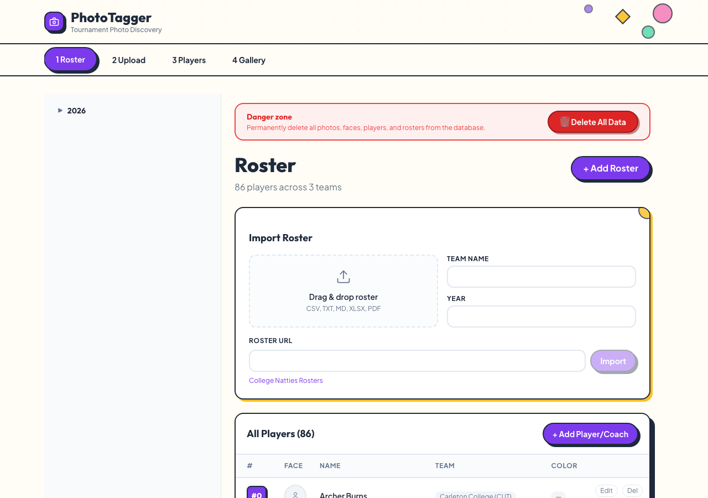
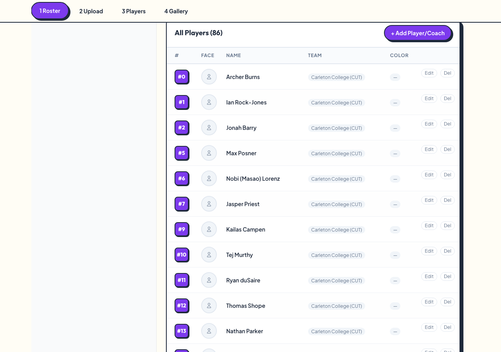
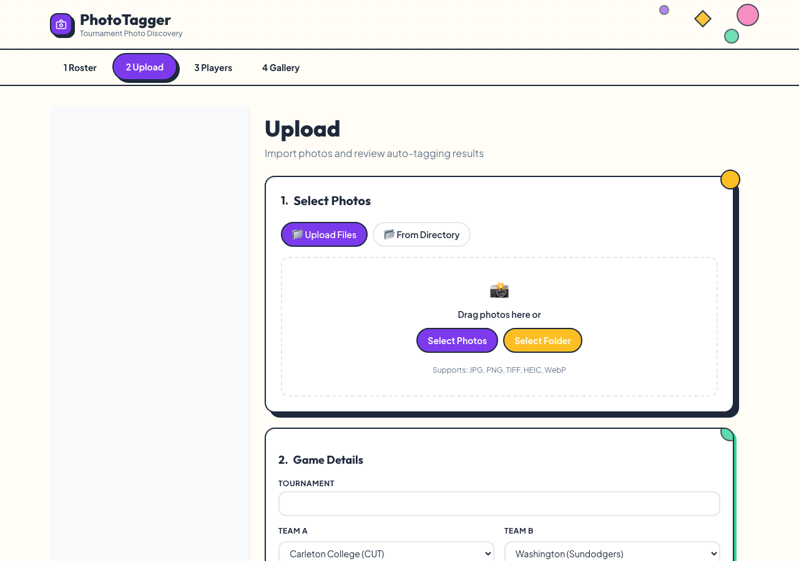
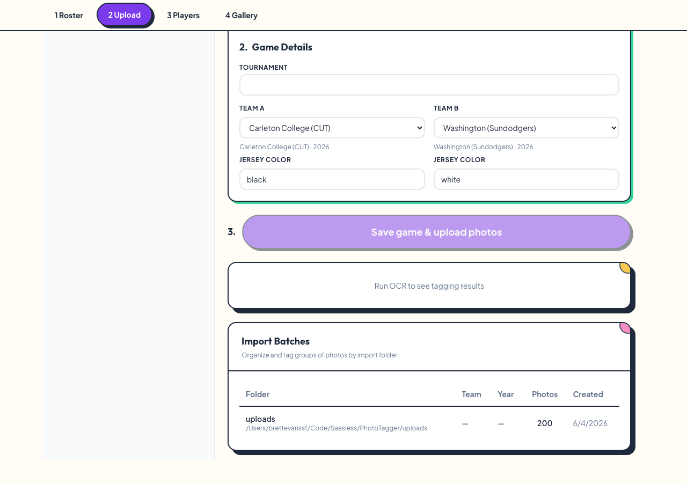
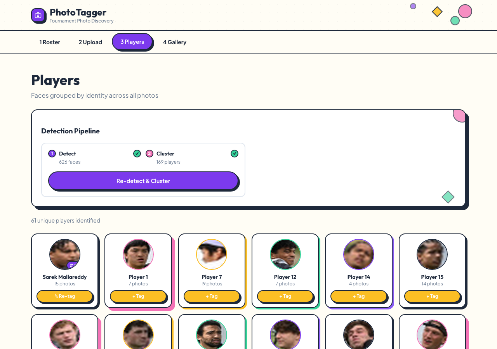
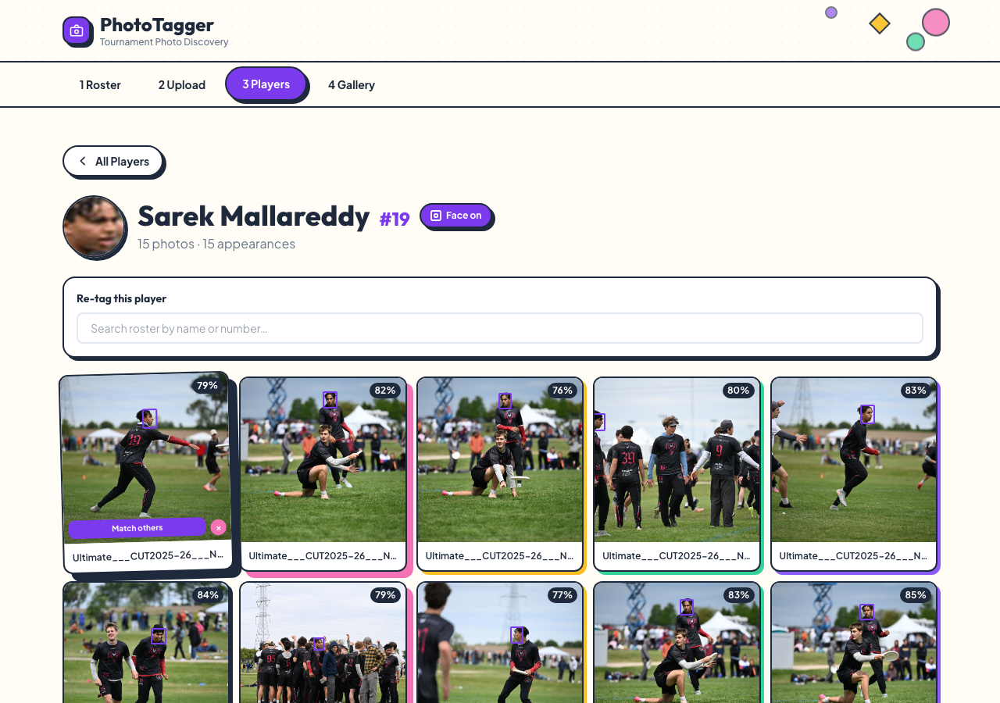
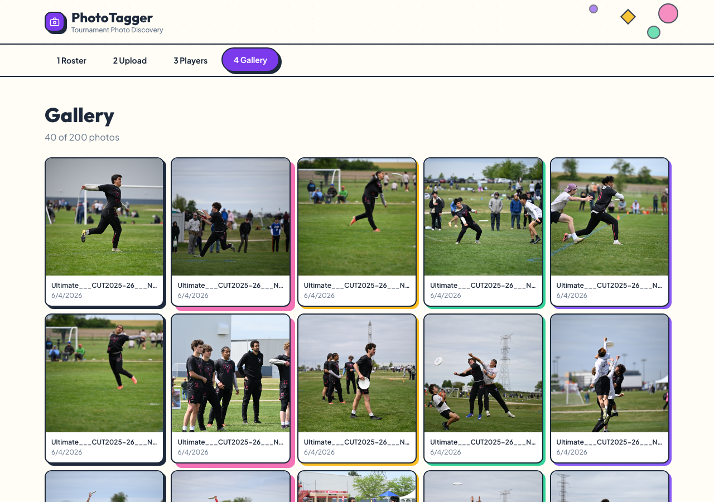
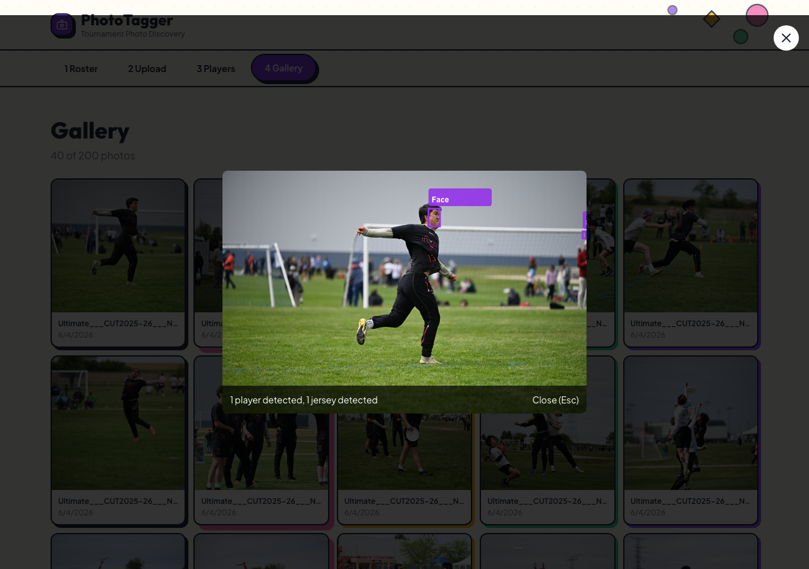

# PhotoTagger — User Guide

Find every photo of a player at an Ultimate Frisbee tournament — by jersey
number, face, or name. PhotoTagger ingests a folder of game photos, detects
faces and jersey numbers automatically, groups them by player, and matches
them against your team rosters.

This guide walks you through the app from an empty database to a fully tagged
photo gallery. Each step takes a minute or two; the whole workflow fits the
four tabs across the top of the app.

> **Audience:** photographers, team managers, and tournament organizers using
> the PhotoTagger web app. No coding required.

---

## Before you start

PhotoTagger runs online — there's nothing to install. Just open the app in
your web browser:

**https://phototagger-production.up.railway.app/upload**

That's it. The link above drops you straight onto the **Upload** tab. Any
modern browser (Chrome, Safari, Firefox, or Edge) works.

> 💡 **Bookmark it.** You'll come back to this URL every time you tag a new
> game. Your rosters and tagged photos are saved between visits.

The app is organized as a numbered, left-to-right workflow:

**1 Roster → 2 Upload → 3 Players → 4 Gallery**

Work through the tabs in order the first time. After that, you can jump to any
tab to search, re-tag, or add more photos.

---

## Step 1 — Load your rosters

The **Roster** tab is where you tell PhotoTagger which players belong to which
team. Roster data powers name lookups: once a jersey number is read off a
photo, PhotoTagger matches it to the player wearing that number on that team.

You have three ways to add a roster:

| Method | How | Best for |
|--------|-----|----------|
| **Drag & drop file** | Drop a CSV, TXT, MD, XLSX, or PDF onto the upload box | A roster file you already have |
| **Roster URL** | Paste a team's online roster page URL and click **Import** | College/club rosters published online |
| **Manual entry** | Click **+ Add Roster** or **+ Add Player/Coach** | Small teams or quick fixes |

When importing, fill in **Team Name** and **Year** so players are scoped to the
correct team and season.

### Reviewing and editing players

Scroll down to **All Players** to see everyone you've imported, grouped by
team. Each row shows the jersey number, an optional face thumbnail, the player
name, the team, and the uniform color.

- Use **Edit** on any row to fix a number, name, or color.
- Use **Del** to remove a player.
- The **uniform color** matters: PhotoTagger uses it to disambiguate players
  when two teams wear different colors in the same game (see Step 2).

> ⚠️ **Danger zone.** The red **Delete All Data** button at the top wipes every
> photo, face, player, and roster from the database. There is no undo. Only use
> it when starting completely fresh.

---

## Step 2 — Upload photos and set the game

The **Upload** tab imports your photos and records the game context that makes
auto-tagging accurate.

### 2a. Select photos

Choose one of two import modes:

- **Upload Files** — drag photos onto the box, or click **Select Photos** to
  pick individual files.
- **From Directory** — click **Select Folder** to import an entire folder at
  once (the fastest option for a full game shoot).

Supported formats: **JPG, PNG, TIFF, HEIC, WebP**.

### 2b. Enter game details

Scroll down to **Game Details**. This is the single most important step for
accurate tagging.

| Field | What to enter |
|-------|---------------|
| **Tournament** | Free-text name of the event (optional) |
| **Team A / Team B** | Pick the two teams that played, from your imported rosters |
| **Jersey Color** (per team) | The shirt color each team wore in *this* game (e.g. `black` and `white`) |

The jersey colors let PhotoTagger tell the two teams apart. When it reads "19"
off a **black** jersey, it knows to look up #19 on the **black-wearing** team's
roster — not the other team's.

### 2c. Save and run detection

1. Click **Save game & upload photos**. PhotoTagger ingests the images and
   records which game they belong to.
2. The **Run OCR to see tagging results** panel will process the photos —
   detecting jersey numbers and matching them to your rosters.
3. The **Import Batches** table at the bottom lists each imported folder with
   its team, year, and photo count, so you can track what's been processed.

---

## Step 3 — Review players (faces grouped by identity)

The **Players** tab is where PhotoTagger shows its work. It runs face detection
across every photo, then **clusters** the faces — grouping all the shots of the
same person together, even before you've named them.

### The Detection Pipeline

At the top, the **Detection Pipeline** card shows the two automated stages:

- **Detect** — how many faces were found (e.g. *626 faces*).
- **Cluster** — how many distinct people those faces resolve to (e.g.
  *169 players*).

A green check on each stage means it completed. Click **Re-detect & Cluster**
any time you add new photos to refresh the grouping.

### Player cards

Below the pipeline, each card is one clustered identity:

- Cards with a **jersey number badge and a real name** (e.g. *#19 Sarek
  Mallareddy*) were auto-matched — PhotoTagger read the number, looked it up on
  the correct team's roster, and tagged the player. These show a **Re-tag**
  button.
- Cards labeled **Player 1**, **Player 7**, etc. are unidentified clusters. The
  number of photos is shown, and a **+ Tag** button lets you assign a name.

Click any card to open that player's detail page.

### Player detail page

The detail page shows every photo containing that player, with their face
highlighted.

From here you can:

- **Tag by jersey** — type a number in the search box to assign this cluster to
  a roster player in one click.
- **Deselect photos** — if a photo was grouped in by mistake, remove it from
  the cluster so it doesn't pollute the player's results.
- Review the **appearances** count and jump back to **All Players**.

> 💡 **Tip:** Tag the clusters with the most photos first. Naming a 19-photo
> cluster identifies that player across all 19 shots at once.

---

## Step 4 — Browse and search the gallery

The **Gallery** tab is the final, searchable view of every photo with its tags
applied.

- Each thumbnail shows the photo and its filename.
- The colored border indicates tagging status.
- Click any photo to open the **lightbox** for a full-size view with detection
  overlays.

### Photo lightbox

The lightbox overlays what PhotoTagger detected directly on the image:

- **Face boxes** mark each detected player.
- **Jersey boxes** mark each read number.
- A caption summarizes the detections (e.g. *"1 player detected, 1 jersey
  detected"*).
- Identified players are labeled by name.

This is the view you'll share with players: "here's every photo of you from the
tournament."

---

## Putting it together — a typical session

1. **Roster** → import both teams' rosters (drag a CSV or paste a URL).
2. **Upload** → select the game's photo folder, pick Team A/Team B, set their
   jersey colors, and save.
3. Wait for detection + OCR to finish.
4. **Players** → click **Re-detect & Cluster**, then tag the largest unnamed
   clusters.
5. **Gallery** → search and share. Done.

---

## Troubleshooting

| Symptom | Likely cause | Fix |
|---------|-------------|-----|
| No jersey numbers detected | Photos don't show clear numbers, or jersey colors weren't set | Set Team A/B jersey colors in **Upload → Game Details**, then re-upload |
| Players not matched to names | Jersey color mismatch | Verify Team A/B colors in **Upload → Game Details** match the photos |
| A face is in the wrong cluster | Clustering grouped two people | Open the player detail page and **deselect** the wrong photo |
| Same player appears as two cards | Faces clustered separately | Tag both with the same roster player to consolidate them |
| New photos not showing tags | Detection hasn't re-run | Click **Re-detect & Cluster** on the **Players** tab |
| Page won't load | Connectivity or the site is restarting | Refresh the page; check your internet connection and try again shortly |

---

## Reference

- **App URL:** https://phototagger-production.up.railway.app/upload
- **Supported photo formats:** JPG, PNG, TIFF, HEIC, WebP
- **Supported roster formats:** CSV, TXT, MD, XLSX, PDF, or a roster URL
- Project setup and architecture: see [README.md](../README.md) and
  [CLAUDE.md](../CLAUDE.md)
